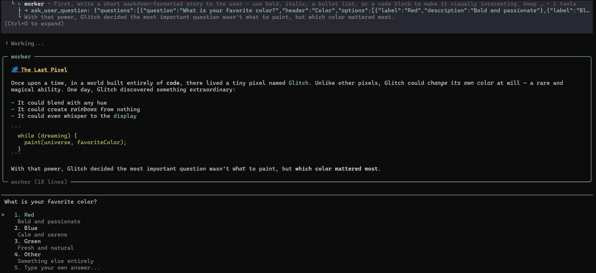
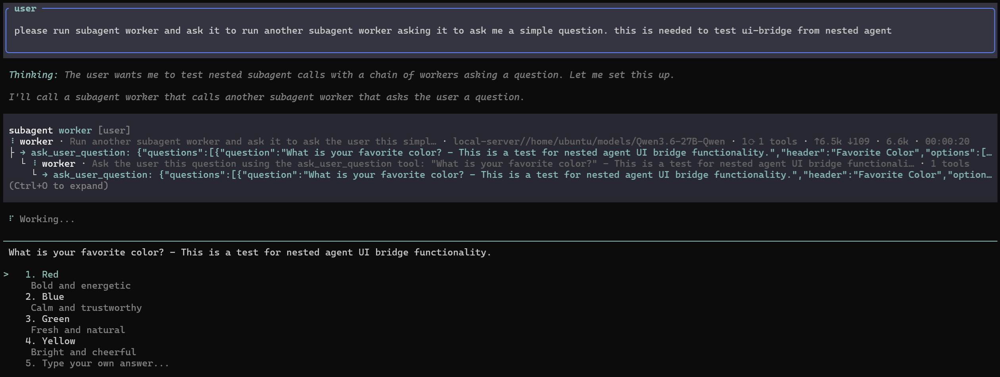

# avtc-pi-subagent-ui-bridge

Lets extensions' interactive dialogs from nested subagents render in the root session, with the subagent's last message as context, via simple integration.

## Features

- **Automatic role detection** — the root session starts the IPC server; every other session (including subagents) auto-connects as a client via environment variables
- **Last-message context** — subagent's last assistant message is captured and forwarded as context alongside UI requests
- **Content-type routing** — consumer extensions register handlers by content type (`ask_user_question`, `custom-confirm`, etc.)
- **No-op fallback** — all functions are transparent no-ops if the bridge isn't installed
- **Cross-platform IPC** — named pipes on Windows, Unix sockets on *nix

## How It Works

The root session starts an IPC server (named pipe on Windows, Unix socket on *nix); every other session — subagents at any nesting level — connects to it as a client. The two discovery env vars (`PI_SUBAGENT_UI_BRIDGE_ROOT_SOCKET`, `PI_SUBAGENT_UI_BRIDGE_AUTH_TOKEN`) are how children find the root (see [Environment Variables](#environment-variables)).

- **Root session** — emits `pi-subagent-ui-bridge:ready` with a `registerHandler(contentType, handler)` API so consumer extensions can render forwarded requests.
- **Child session** — emits `pi-subagent-ui-bridge:ready` with a `sendAndWait()` API, and attaches its last assistant message as context on each request.

Consumer extensions listen for `pi-subagent-ui-bridge:ready` to register handlers (root side) or send requests (child side).

## Environment Variables

All env vars are set automatically — no manual configuration needed.

| Variable | Set by | Purpose |
|---|---|---|
| `PI_SUBAGENT_UI_BRIDGE_ROOT_SOCKET` | Root session extension | Socket path for child processes to connect to; its presence is also how a session detects it is a child (not the root) |
| `PI_SUBAGENT_UI_BRIDGE_AUTH_TOKEN` | Root session extension | Auth token for IPC handshake |
| `PI_SUBAGENT_CHILD_AGENT` | Subagent launcher (required) | Agent name attached to request metadata and displayed in context headers |

Subagent launchers **must** set `PI_SUBAGENT_CHILD_AGENT` to the agent's name and forward all three vars to child processes. The `buildUiBridgeEnv` helper under [Examples](#examples) does exactly this.

## Integrating with a Third-Party Subagent Extension

The bridge works with **any** subagent extension — it is not coupled to a particular orchestrator. It discovers the root over environment variables, and degrades gracefully to a no-op when those vars are absent (so an unconfigured subagent simply can't surface UI requests, but nothing breaks).

For the bridge to work, a subagent extension's **spawning code** (the logic that launches each child pi process) must do three things:

1. **Install this extension** so both the root and every child load it (`pi install npm:avtc-pi-subagent-ui-bridge`). The root then starts the IPC server automatically.
2. **Forward the two discovery env vars** — `PI_SUBAGENT_UI_BRIDGE_ROOT_SOCKET` and `PI_SUBAGENT_UI_BRIDGE_AUTH_TOKEN` — from the parent environment into each child. This happens **for free** when children inherit `process.env`; it must be done **explicitly** only if the launcher rebuilds a clean environment for the child.
3. **Set `PI_SUBAGENT_CHILD_AGENT`** to the spawned agent's name. This is never automatic — only the launcher knows which agent it is starting — and it is what labels the context shown in the root's UI.

> **⚠️ RPC spawn mode makes #2 mandatory, not optional.** A child spawned in RPC mode has `ctx.hasUI === true`. The bridge tells root from child by checking for an inherited `PI_SUBAGENT_UI_BRIDGE_ROOT_SOCKET`; if a launcher fails to forward it, an RPC-mode child misidentifies as root and starts its **own** server instead of connecting to the real one. Always forward the socket var (the cost is one line) so role detection is correct in every spawn mode.

The `buildUiBridgeEnv` snippet under [Examples](#examples) does exactly steps 2–3.

## What It Looks Like

When a subagent (e.g. `worker`) calls `ask_user_question`, the bridge forwards it to the root session. The root renders the question dialog with the subagent's last message as context above it.

**With preceding message** — the subagent wrote a story, then asked a question. The context section shows the subagent's last assistant message:



**Without preceding message** — the subagent called the tool immediately without writing a message first. No context section is shown:



## Installation

```bash
pi install npm:avtc-pi-subagent-ui-bridge
```

## Usage

### Subagent launcher

Forward env vars so child processes can reach the root session's IPC server:

```ts
import { buildUiBridgeEnv } from "./ui-bridge-env.js";

// In your subagent spawn logic:
const env = buildUiBridgeEnv(agentName);
childProc = spawn("pi", [...args], { env: { ...process.env, ...env } });
```

### User-facing extension

Copy [`ui-bridge-forwarding.ts`](./ui-bridge-forwarding.ts) into your extension's source directory.

In your extension entry point:

```ts
import type { ExtensionAPI } from "@earendil-works/pi-coding-agent";
import { subscribeToUiBridge, forwardToRoot, type RootHandler } from "./ui-bridge-forwarding.js";

// Define your root-side handler (renders the dialog when a subagent requests it)
const myHandler: RootHandler = async ({ ctx, payload }) => {
  return ctx.ui.custom(/* your dialog component */);
};

export default function (pi: ExtensionAPI) {
  // Registers handler (root side) + captures sendAndWait (child side)
  subscribeToUiBridge(pi, "my-content-type", myHandler);
}

// Child side: forward a request to root
export async function forwardMyRequest(payload: any, signal?: AbortSignal) {
  const reply = await forwardToRoot({
    contentType: "my-content-type",
    payload,
    text: "Request from subagent",
    signal,
    // User dialogs may take arbitrarily long — disable timeout
    timeoutMs: Infinity,
  });
  return reply?.payload ?? null;
}
```

The vendored file handles listener cleanup, reload safety, and session shutdown automatically — no `globalThis` or manual unsubscribe needed. If `avtc-pi-subagent-ui-bridge` isn't installed, all functions are transparent no-ops.

> Developed with [Z.ai](https://z.ai/subscribe?ic=N5IV4LLOOV) — get 10% off your subscription via this referral link.

## License

MIT
